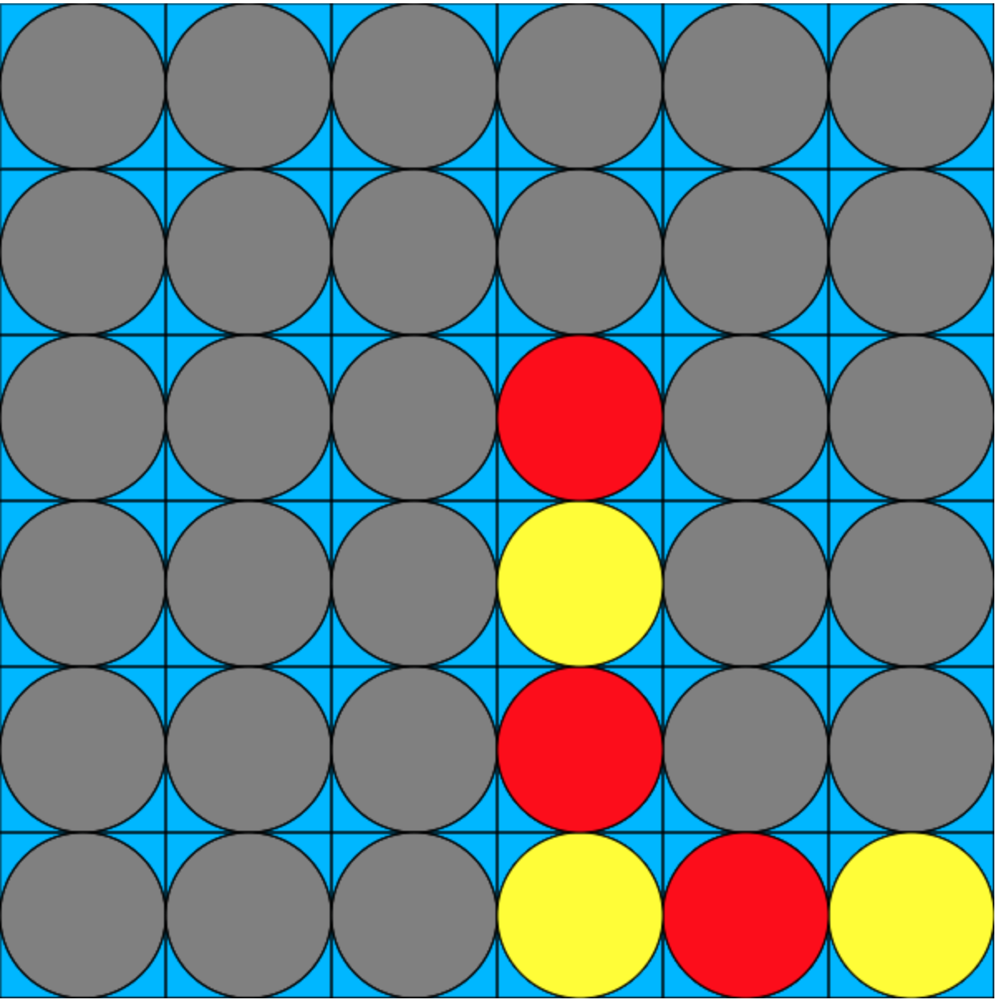

## Connect 4

To run:
`node app.js`

Url: `localhost:5000`


The model of the game is a 2d-array. Initially, all the cells are set to -1.

```
    var board = [
            [-1, -1, -1, -1, -1, -1],
            [-1, -1, -1, -1, -1, -1],
            [-1, -1, -1, -1, -1, -1],
            [-1, -1, -1, -1, -1, -1],
            [-1, -1, -1, -1, -1, -1],
            [-1, -1, -1, -1, -1, -1]
        ];
```

Once a player trigger a mouse event, the position is mapped.
Then use a loop to find the next free slot.

```
while (board[row][col] !== -1 && row > 0){  row -= 1;}
```

After that, update the view first so the player is unaware of what is going on.


After that, check the model if there is a winner.

```
 if(checkWinner(player)) {}
```




